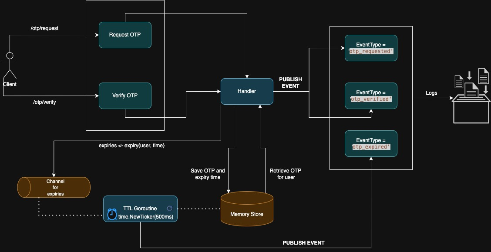

# 🧪 Mock OTP Microservice

A Go-based microservice that simulates an OTP (One-Time Password) system, allowing users to **request** and **verify** OTPs. Built to demonstrate Go concurrency, Docker containerization, and Kubernetes deployment on a local Minikube cluster.

---

## 🚀 Features

- **Request OTP**: Generates a 6-digit OTP for a given user.
- **Verify OTP**: Verifies the submitted OTP against the one stored.
- **Auto-expiry**: OTPs expire after a TTL using Go routines and channels.

---

## 🧱 Architecture



### 🔹 API Endpoints
| Method | Endpoint         | Description              |
|--------|------------------|--------------------------|
| POST   | `/otp/request`   | Request a new OTP        |
| POST   | `/otp/verify`    | Verify a submitted OTP   |

### 🔹 Internals

- OTPs are stored in-memory with a defined TTL (e.g., 300s).
- A goroutine-based expiry watcher monitors and deletes expired OTPs using Go channels.
- An internal queue (channel) is used to communicate new OTP requests and expiry scheduling.
- Demonstrates Go concurrency primitives (goroutines, channels) in action.
- Implements TTL-based expiration logic in a lightweight, event-driven manner.
- Fully Dockerized for portability.
- Supports Kubernetes Deployments, Services, and ConfigMaps.
- Deployable on a local Minikube cluster for testing and demonstration.

## 🧪 Example Curl Requests

### ✅ Request OTP
```bash
curl -i -X POST http://localhost:8080/otp/request \
     -H "Content-Type: application/json" \
     -d '{"user":"alice"}'
```

### ✅ Verify OTP
```bash
curl -i -X POST http://localhost:8080/otp/verify \
     -H "Content-Type: application/json" \
     -d '{"user":"charlie","code":"123456"}'
```

---

## 🐳 Docker Containerization

### Build the Docker image
```bash
docker build -t otp-service:latest .
```

> The image uses a `Dockerfile` that builds and runs the Go service inside a lightweight Alpine container.

---

## ☸️ Kubernetes Deployment (Minikube)

### 🛠️ Prerequisites
- Docker installed
- Minikube installed and running
- `kubectl` configured to point to your Minikube cluster

### Set Docker to use Minikube's Docker daemon
```bash
eval $(minikube docker-env)
```

### Build inside Minikube
```bash
docker build -t otp-service:latest .
```

### Deploy resources
```bash
kubectl apply -f k8s/configmap.yaml
kubectl apply -f k8s/deployment.yaml
kubectl apply -f k8s/service.yaml
```

To redeploy:

```
kubectl rollout restart deployment otp-deployment
```

### Get the service URL
```bash
minikube service otp-service --url
```

---

## 📜 Viewing Logs

### Get pod names
```bash
kubectl get pods
```

### View logs (streaming)
```bash
kubectl logs -f <pod-name>
```

Example:
```bash
kubectl logs -f otp-deployment-7c4c9755b8-nkvb6
```


## 📁 Project Structure

```
mock-otp-service/
├── handlers/         # API handlers
├── store/            # OTP storage logic
├── events/           # Broker and pub-sub queue logic
├── main.go           # Entry point
├── Dockerfile        # Container build instructions
├── k8s/              # Kubernetes YAMLs
│   ├── configmap.yaml
│   ├── deployment.yaml
│   └── service.yaml
└── README.md
```

---

## 💬 Future Improvements
- Integrate real SMS/email provider
- Add metrics and alerting (e.g. Prometheus + Grafana)